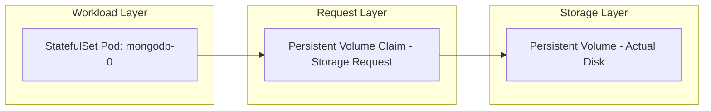
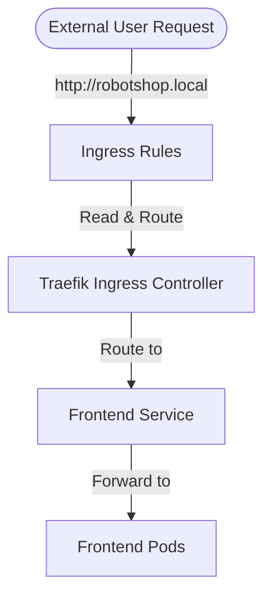
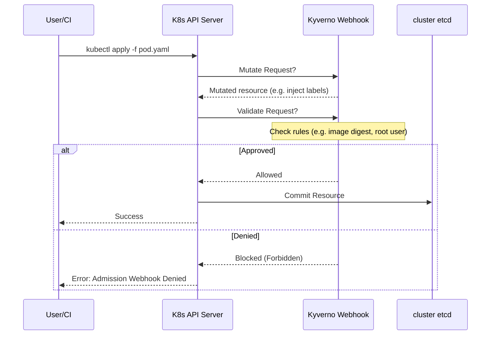
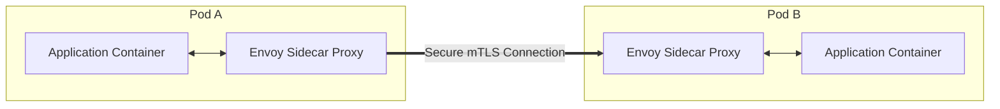

# Complete Kubernetes & Helm Setup Guide

This guide is a comprehensive tutorial for setting up a local Kubernetes development environment, installing core operators, and understanding fundamental Kubernetes concepts.

---

## 1. Local Kubernetes Environment Setup

To deploy applications like the `robotshop` microservice chart locally, you need three core command-line tools: **Minikube**, **kubectl**, and **Helm**.

### A. Installing Minikube
Minikube runs a local, single-node Kubernetes cluster inside a container or VM.

#### Installation (Linux/Ubuntu):
```bash
# Download the latest Minikube binary
curl -LO https://storage.googleapis.com/minikube/releases/latest/minikube-linux-amd64

# Install it to your local executable path
sudo install minikube-linux-amd64 /usr/local/bin/minikube

# Verify installation
minikube version
```

#### Starting the Cluster:
```bash
# Start Minikube using Docker as the driver (recommended)
minikube start --driver=docker
```

---

### B. Installing kubectl
`kubectl` is the official command-line tool used to communicate with the Kubernetes API server.

#### Installation (Linux/Ubuntu):
```bash
# Download the latest stable release
curl -LO "https://dl.k8s.io/release/$(curl -L -s https://dl.k8s.io/release/stable.txt)/bin/linux/amd64/kubectl"

# Install it
sudo install -o root -g root -m 0755 kubectl /usr/local/bin/kubectl

# Verify installation
kubectl version --client
```

---

### C. Installing Helm
Helm is the package manager for Kubernetes. It simplifies templating and deploying multiple Kubernetes resources as a single unit (called a "Chart").

#### Installation (Linux/Ubuntu):
```bash
# Download and run the official Helm installation script
curl -fsSL -o get_helm.sh https://raw.githubusercontent.com/helm/helm/main/scripts/get-helm-3
chmod 700 get_helm.sh
./get_helm.sh

# Verify installation
helm version
```

---

## 2. Installing Core Cluster Resources & Operators

Once your cluster is running, you must install the ingress controller, autoscalers, and policy engines required by your templates.

### A. Installing Traefik Ingress Controller
An Ingress controller is responsible for routing external traffic into the cluster based on rules defined in your Ingress resources.

```bash
# Add the Traefik Helm repository
helm repo add traefik https://traefik.github.io/charts
helm repo update

# Install Traefik in its own namespace
helm install traefik traefik/traefik \
  --namespace traefik \
  --create-namespace
```

### B. Installing KEDA (Autoscaler)
KEDA (Kubernetes Event-driven Autoscaling) allows you to scale workloads based on external event metrics (like RabbitMQ queues, Prometheus queries, etc.).

```bash
# Add KEDA Helm repository
helm repo add kedacore https://kedacore.github.io/charts
helm repo update

# Install KEDA
helm install keda kedacore/keda \
  --namespace keda \
  --create-namespace
```

### C. Installing Kyverno (Policy Engine)
Kyverno is a Kubernetes-native policy engine that uses standard YAML to validate, mutate, or generate cluster resources.

```bash
# Add Kyverno repository
helm repo add kyverno https://kyverno.github.io/kyverno/
helm repo update

# Install Kyverno
helm install kyverno kyverno/kyverno \
  --namespace kyverno \
  --create-namespace
```

### D. Installing OPA Gatekeeper (Policy Engine)
Gatekeeper is another widely used policy controller that integrates Open Policy Agent (OPA) into Kubernetes.

```bash
# Add Gatekeeper repository
helm repo add gatekeeper https://open-policy-agent.github.io/gatekeeper/charts
helm repo update

# Install Gatekeeper
helm install gatekeeper gatekeeper/gatekeeper \
  --namespace gatekeeper-system \
  --create-namespace
```

---

## 3. Deep-Dive: Core Kubernetes Concepts Explained

### A. Deployments vs. StatefulSets (Stateless vs. Stateful Workloads)

In Kubernetes, workloads are separated based on whether they need to persist data across pod restarts.

#### 1. Deployments (Stateless Workloads)
*   **What it does**: A `Deployment` manages stateless pods (e.g., web servers, microservice APIs).
*   **ReplicaSet**: It uses an underlying `ReplicaSet` to ensure the desired number of pods are always running.
*   **Pod Lifecycle**: Pods are completely interchangeable. They receive random, ephemeral suffixes (e.g., `frontend-5d6b49c7-abc12`). If a pod dies, Kubernetes kills it and spawns a new one with a different name. No state is saved on the pod itself.

#### 2. StatefulSets (Stateful Workloads)
*   **What it does**: A `StatefulSet` manages stateful pods (e.g., databases like MongoDB, Redis, Postgres).
*   **Stable Identity**: Pods receive ordered, deterministic names starting from index 0 (e.g., `mongodb-0`, `mongodb-1`).
*   **Ordered Operations**: Pods are scaled, upgraded, or terminated one at a time, in order.
*   **Stable Storage**: Ensures that a specific pod is always tied to its own persistent storage volume, even if the pod is rescheduled onto a different node.

---

### B. Persistent Volumes (PV), Claims (PVC), and StatefulSet Integration

To persist data, Kubernetes separates storage provisioning from the workload using **PVs** and **PVCs**.



1.  **Persistent Volume (PV)**:
    *   The actual physical storage resource in the cluster (like an AWS EBS volume, a local directory, or a Minikube standard directory).
2.  **Persistent Volume Claim (PVC)**:
    *   A user's request for storage. It defines the size (e.g., `1Gi`) and access modes (e.g., `ReadWriteOnce`).
3.  **StatefulSet & `volumeClaimTemplates`**:
    *   In a standard `Deployment`, if you scale to 3 replicas, all 3 replicas share the *same* volume claim, which causes issues for databases trying to write to the same files.
    *   In a `StatefulSet`, we use `volumeClaimTemplates` instead of pre-defined volumes.
    *   **How it works**: For every replica spawned (e.g., `mongodb-0`, `mongodb-1`), the StatefulSet controller automatically generates a unique PVC for that pod (e.g., `mongo-data-mongodb-0`). Kubernetes then provisions a separate PV for each PVC. If pod `mongodb-0` dies and is recreated, it automatically binds back to the existing `mongo-data-mongodb-0` PVC, preserving the database files intact.

---

### C. Services: Connecting Workloads

Because pods are ephemeral (constantly created and destroyed), their IP addresses change. A **Service** provides a stable entry point (IP and DNS name) to route traffic to pods.

*   **Service Selector**: Services use labels (e.g., `app: frontend`) to target pods.
*   **Types**:
    *   **`ClusterIP`**: Exposes the service on a cluster-internal IP. Internal microservices (like backend connecting to db) use this.
    *   **`NodePort`**: Exposes the service on a static port on each cluster node's IP. External users can access it at `<NodeIP>:<NodePort>`.
    *   **`LoadBalancer`**: Provisions an external LoadBalancer in cloud environments. On Minikube, running `minikube tunnel` makes this accessible on your host machine.
    *   **`ExternalName`**: Maps a service to a DNS name (using a CNAME record) rather than selector labels. Used to alias external dependencies.

---

### D. Ingress, Traefik, and Traffic Routing

While a `NodePort` or `LoadBalancer` exposes a single service, an **Ingress** acts as a smart router (reverse proxy) at the edge of your cluster.



1.  **Ingress Resource**:
    *   A set of routing rules (e.g., "Any requests for host `robotshop.local` and path `/` should be routed to the `frontend-service` on port `80`").
2.  **Traefik Ingress Controller**:
    *   The active implementation engine. The Ingress resource is just a configuration file. Traefik sits at the edge of the cluster, reads those Ingress rules, configures its internal routing table, intercepts incoming HTTP requests, and proxies them to the correct internal ClusterIP service.

---

### E. Kyverno: Kubernetes Policy Engine

Kyverno enforces security and compliance regulations directly at the API server level using **Admission Webhooks**.



1.  **Validating Webhooks**:
    *   Checks incoming YAML files against security policies. If a rule is violated (e.g., a container tries to run with root permissions or without an image digest), Kyverno blocks the resource creation and throws a validation error.
2.  **Mutating Webhooks**:
    *   Automatically modifies incoming resources. For example, if a pod is created without a required label, Kyverno can inject the label dynamically before writing the resource to the cluster database.

---

## 4. Advanced Cluster Capabilities: KEDA & Istio

### A. KEDA (Kubernetes Event-driven Autoscaling)

The native Kubernetes Horizontal Pod Autoscaler (HPA) can only scale pods based on core server metrics: **CPU and Memory** utilization. However, real-world systems often need to scale based on business events or message cues.

*   **What KEDA does**: KEDA bridges the gap. It is an operator that acts as a custom metrics server, allowing you to scale Kubernetes workloads up/down based on external events (e.g., AWS SQS messages, Kafka lag, RabbitMQ queues, Prometheus queries, or custom database queries).
*   **Key Capabilities**:
    *   **Scale to Zero (`0`)**: The native Kubernetes HPA cannot scale down to 0 replicas (it requires at least 1). KEDA can scale a workload down to 0 replicas when there is no activity, and scale it back up to 1 when a new message/event arrives.
    *   **ScaledObject**: A KEDA resource where you define what to scale (e.g., `Deployment` or `StatefulSet`), the scaling range (min/max), and the **Triggers** (event sources).

---

### B. Istio Service Mesh

In microservices architectures, services talk to each other over the network. Managing security, routing rules, and metrics for all these interactions inside application code is tedious. **Istio** solves this by establishing a **Service Mesh**—an infrastructure layer dedicated to service-to-service communication.



*   **How it works (Sidecar Proxy Pattern)**:
    *   When you enable Istio in a namespace (`istio-injection=enabled`), Istio automatically injects an **Envoy Proxy sidecar container** inside every Pod.
    *   All network traffic leaving or entering the application container is transparently intercepted and managed by its local Envoy proxy.
*   **Core Pillars of Istio**:
    1.  **Security (mTLS)**: All service-to-service communication is automatically encrypted using Mutual TLS (mTLS). Istio manages certificate generation, distribution, and rotation dynamically without requiring changes to application code.
    2.  **Traffic Management**: Provides advanced routing features:
        *   **Canary Deployments**: Route 10% of traffic to version `v2` and 90% to `v1`.
        *   **Resilience**: Configures circuit breakers, retries, and rate limits.
    3.  **Observability (Telemetry)**: Automatically aggregates latency, error rates, and request rates, generating dependency maps (e.g. via the Kiali dashboard) of all services talking to one another.

---

## 5. Useful Minikube CLI Utilities

*   `minikube ip`: Returns the IP address of the Minikube node. You use this IP to access services exposed via `NodePort`.
*   `minikube tunnel`: Creates a network route on your host machine to make `LoadBalancer` services and Ingress routes accessible from your host web browser (e.g., visiting `http://robotshop.local`).
